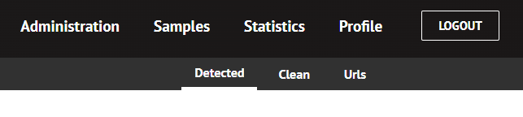
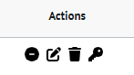

# ESET Sampleshare

ESET Research CZ
  
Documentation and install guide
-----------------------------------------------------------------------

## **Contents** 

1. [Introduction](#introduction)
2. [Project Dependencies](#project-dependencies)
3. [Installation guide](#installation-guide)
4. [Usage](#usage)
    1. [Admin interface](#admin-interface)
    2. [External interface](#external-interface)
    3. [API](#api)
    4. [Samples](#samples)
5. [Contribution](#contribution)
6. [Contact](#contact)

## Introduction

This is a Sampleshare application developed by ESET Research CZ built on
NSSF (Norman Sample Sharing Framework). It uses Node.js and
React and is fully built in JavaScript. The app is used for organizing
malicious as well as clean samples and URLs. It also offers various
statistics about every user, sample group and download traffic.

External users are open to create their accounts and download a
subscription script after they get their clearance from an admin and are
verified. After this, users are able to download sample files available to
them.

Admins can view and manage all samples, users and their permissions.

You can find the source code published under BSD-2-Clause license.
Contributions to the project are welcome and all users can create pull
requests with their changes to the application.

## Project Dependencies

The application was developed mainly for Linux servers, but is portable
to Windows with few changes to the configuration. The frontend runs on
React.js, backend is built on Node.js and Express.js. Supplied
maintenance and import scripts use Python.

Requirements are:

-   [Python 3](https://www.python.org/)
-   [Node.js](https://nodejs.org/)
-   [React.js](https://react.dev/)
-   [npm](https://www.npmjs.com/)
-   [MariaDB](https://mariadb.org/)
-   [Nginx](https://www.nginx.com/)

## Installation guide

To begin, please install all the required dependencies listed above.
Then you need to modify the configuration file in `/backend/config.json`
and fill in all the blanks for the app to install correctly. Also,
generate your secret auth and refresh keys that are used in JWT
authentication tokens.

Notable config parameters description:

| Parameter                | Description
| ---                      | ---
| `admin_{email,password}` | Credentials for your initial admin account
| `samples_path`           | Path to samples folder where they will be imported
| `nginx`                  | Flag for automatic nginx configuraton
| `nginx_path`             | Path to nginx folder (default `/etc/nginx`)
| `cron_jobs`              | Flag for automatic cron job configuration
| `hostname_url`           | URL of the app (format: www.example.org)
| `keys`                   | JWT secret keys
| `log_path`               | Logger output path
| `salt`                   | Salt for passwords
| `win`                    | Windows flag
| `gnu_path`               | Path to GPG home

When you're done with the configuration, use the supplied install script
for setting up variables and installing dependencies. You will need to
install Python on your machine first to run the script. Start the script
with elevated permissions. If you want to configure your nginx service
yourself, turn off the flag in the config file.

    python3 -m pip install -r scripts/requirements.txt
    sudo python3 scripts/install.py

This will setup the database on your server, create all tables, copy
nginx configuration, install all npm modules critical to the app and
create an initial admin account for you to use.

Now the installation is complete you can start the app by running (can
be used to restart the service or after an update to the source code as
well):

    systemctl nginx restart && pm2 restart all

You're all set and can use the app freely. If there are any errors, they
will be rerouted to the log files.

You can edit the nginx configuration at `/etc/nginx/sites-available/sampleshare`
to enable HTTPS using your key and certificate.

## Usage

The interface lets you browse and manage various data kept by the
application, such as all external and internal users, samples and system
statistics.

## Admin interface

In this preview are discussed main functionalities of the application
from the admin interface.

In the system tab, the admin can view current system stats of the
application server such as CPU load and available storage space on the
system. Main displays of data are contained in Samples / Administration tabs
respectively.

Samples tables are divided into three main groups of Clean, Detected and
URLs. You can filter and sort these tables by any parameter given, view
samples from certain period or only from some group. Other than that,
managing of samples is easy and simple, delete them from storage and
database by clicking the trash icon or disable download of the sample by
using the minus icon.

User tables are similar in usage, but you can edit information of each
user separately (edit their sample rights, GPG key or reset their
password) and approve each user for sample subscription. Admins can also
create new admin accounts in the Internal user tab.

Stats tab provides valuable information about all downloaded samples and
their respectable size. You can adjust the date interval to display
desired data. Other than that, there is a built in weekly notification
for admins of all subscribers download statistics.

# External interface

Most important part of the user interaction is the registration, which
is crucial to determine if the user is allowed to use the service. Users
must supply a valid GPG on registration, which will be later used for
encrypting API responses. Each external user must be approved for
subscription by an admin user.

Subscribers can mainly download the supplied script for getting samples
from the server as well as downloading single files by hash right from
the web.

## API

After downloading the script, users that have granted permissions for
subscribing to the API can start downloading right away. Before using
the download script, the user needs to provide their GPG passphrase on
the top of the script code. The API is built on the Norman Samplesharing
Framework, where users must follow a communication protocol. Every
request is required to contain an auth header with the users
credentials. User sends a get request for a hash list with eligible
samples, that the user can download. After that, user sends a request
for each file separately and decrypts the file on users system using
their private key.

## Samples

Samples are uploaded to the app via FTP/SFTP on your server to the
designated directory, where upon installation a directory tree will be
created as below.

    samples_dir
    └── incoming
        ├── clean
        └── detected
            ├── daily_a
            ├── daily_b
            ├── daily_c
            └── daily_droid

Unpacked files are stored here:

    samples_dir
    ├── clean
    └── detected

Your uploaded samples should be archived in a ZIP archive when uploaded
(upload them to the deepest subdirectory). There are subfolders for different
sample categories. A cron job will unpack and import all ZIP archives
from the incoming directory and subfolders. They will be moved to the
detected and clean directories respectively. Each file is stored in a
dynamically created tree within these directories. An example:

    /samples_dir/detected/304/131/313/3041313137393[...]7303836

The hash of the sample is computed and encoded to its hexadecimal value,
then the first 9 digits are taken and 3 subdirectories are created.
The sample is then stored in this location with a unique path with
better search speed.

## Contribution

This project is free to use, distribute and modify to fit your needs.
However, we would be glad if you submitted your changes in a pull
request. Also if you have any features or ideas, you can share them via
Git as well. We will review your changes or ideas and apply them to the
main branch.

If you encounter any vulnerabilities with the Sampleshare
implementation, please report them at
<https://www.eset.com/int/security-vulnerability-reporting/>.

## Contact

- Project owner: <michal.visnovsky@eset.com>
- GitHub: <github@eset.com>
